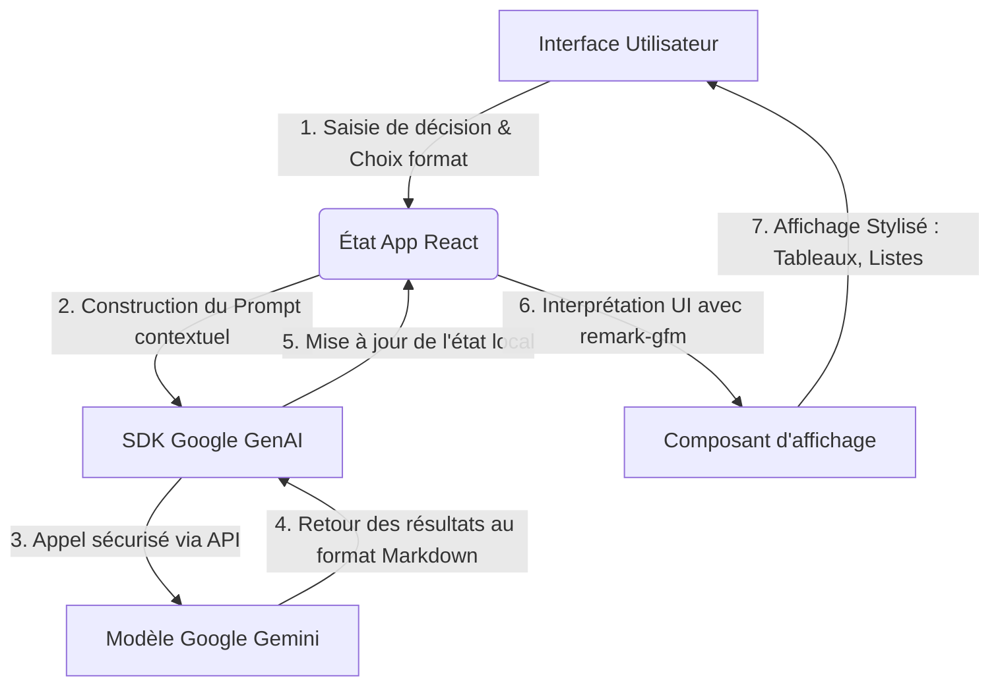

# ⚖️ The Tie Breaker

**The Tie Breaker** est une application web élégante et intelligente, conçue pour vous aider à prendre des décisions complexes. Propulsée par l'intelligence artificielle (Google Gemini), elle analyse vos dilemmes et vous propose des perspectives structurées sous différents formats : liste d'avantages et d'inconvénients, tableau comparatif, ou analyse SWOT.

---

## 🚀 Fonctionnalités

- **Avantages / Inconvénients :** Une analyse claire des points forts et des points faibles de votre décision, suivie d'une brève recommandation.
- **Tableau Comparatif :** Une comparaison structurée visuellement élégante grâce à de véritables tableaux pour évaluer différentes options en fonction de critères clés.
- **Analyse SWOT :** Une matrice stratégique détaillée (Forces, Faiblesses, Opportunités, Menaces) pour prendre du recul sur votre situation.
- **Interface "Elegant Dark" :** Un design moderne, épuré et sombre, garantissant une lisibilité optimale et une expérience utilisateur premium.

---

## 🏗️ Architecture de l'Application

L'application est construite sur une architecture **Single Page Application (SPA)** de pointe, s'exécutant sur le navigateur client et communiquant avec l'API Google Gemini en arrière-plan.

### 🛠️ Stack Technique
- **Frontend :** React 19, TypeScript, Vite
- **Styles :** Tailwind CSS v4, Polices Google Fonts (Inter, Playfair Display, JetBrains Mono)
- **Animations :** Motion (Framer Motion)
- **Icônes :** Lucide React
- **Rendu Markdown interactif :** `react-markdown` couplé au plugin `remark-gfm` pour le support avancé des tableaux ("GitHub Flavored Markdown").
- **Intelligence Artificielle :** SDK `@google/genai` (modèle `gemini-3.1-pro-preview`)

### 📊 Flux de données (Data Flow)



### 📁 Structure des fichiers (Arborescence clés)

```text
/
├── .env.example          # Exemple des variables d'environnement (Clés API)
├── index.html            # Point d'entrée DOM
├── package.json          # Dépendances (React, Motion, Tailwind, Google GenAI, etc.)
├── vite.config.ts        # Configuration du bundler (injection de la clé API)
└── src/
    ├── App.tsx           # Composant central (Gestion d'état, requêtes IA, UI principale)
    ├── index.css         # Thème global "Elegant Dark" et stylisation détaillée du Markdown (tableaux)
    └── main.tsx          # Amorçage de l'application React
```

---

## ⚙️ Prérequis et Installation

### 1. Dépendances
Veillez à avoir [Node.js](https://nodejs.org/) installé sur votre environnement.

### 2. Cloner et Installer
En local, installez les paquets requis pour lancer l'environnement :
```bash
npm install
```

### 3. Configuration requise
Assurez-vous de renseigner votre clé API Gemini. L'application récupère cette clé par défaut via vos configurations secrètes. Modifiez le `.env` pour le développement local si nécessaire :
```env
GEMINI_API_KEY="votre_cle_api_google_gemini_ici"
```

### 4. Lancer le serveur serveur local
```bash
npm run dev
```
Rendez-vous sur la machine locale `http://localhost:3000` ou visitez l'application via les liens fournis.

---

## 🎨 Design System

Ce projet intègre un design nommé **Elegant Dark**, qui ne laisse rien au hasard :
- **Fonds noirs et anthracite :** Les couleurs `#0A0A0B` (fond global) et `#18181B` (surfaces de composants) favorisent une immersion totale dans la réflexion.
- **Micro-interactions :** Animations fluides entre les états "Initial", "Chargement" et "Résultat" grâce à `framer-motion`.
- **Rendu des données IA (Markdown) :** 
  - Les tableaux générés ont des bordures séparées (`border-collapse: separate`), des cellules aérées, et une interaction intuitive au survol des lignes pour lire facilement la comparaison des options.
  - Les citations ont un rendu éditorial grâce à la typographie *Playfair Display*.

---
